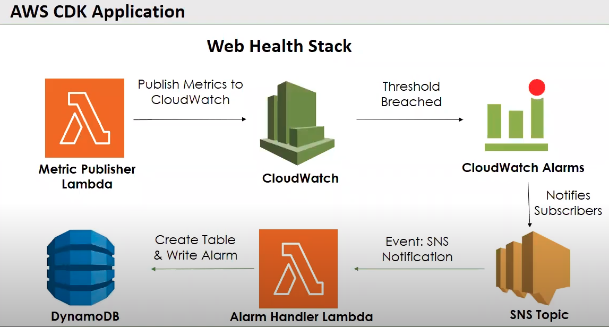
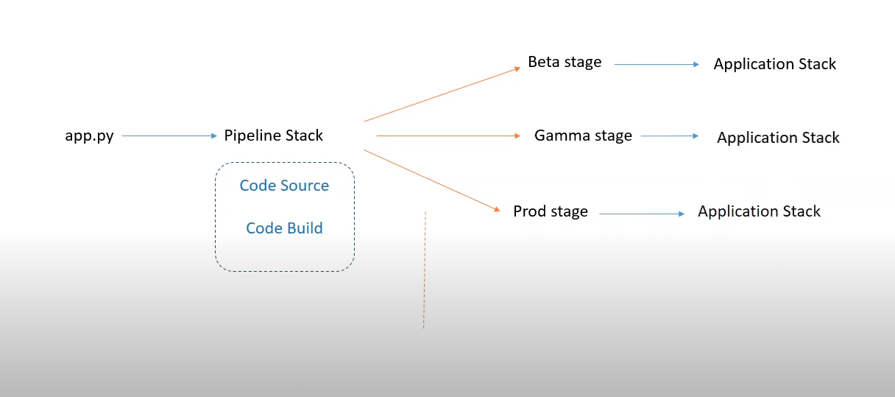
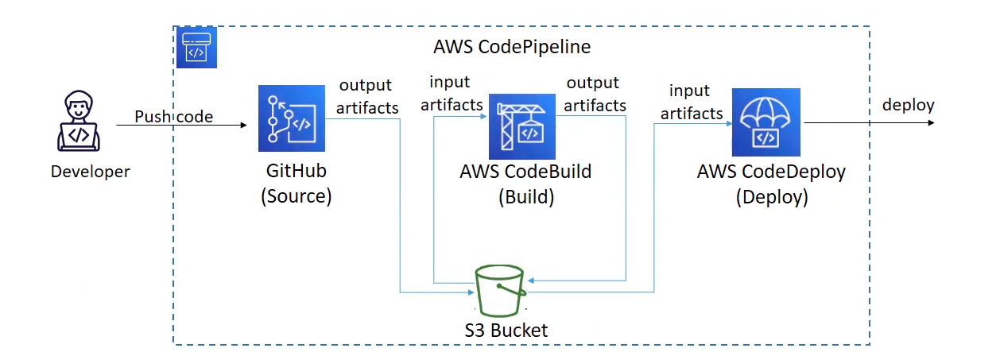

# CI/CD Pipeline for a Web Health App Project!

This is project which get the metrics of a website **latency** and **availability** and notify users and write data to databse when certain metric reaches a threshold value.

The AWS Pipeline will be be used to create CI/CD to automate integrating and deploying new changes to the project.

## Seting up the Project

To start with the project:

Create a virtualenv on MacOS and Linux:

```
$ python3 -m venv .venv
```

After the init process completes and the virtualenv is created, you can use the following
step to activate your virtualenv.

```
$ source .venv/bin/activate
```

If you are a Windows platform, you would activate the virtualenv like this:

```
% .venv\Scripts\activate.bat
```

Once the virtualenv is activated, you can install the required dependencies.

```
$ pip install -r requirements.txt
```

At this point you can now synthesize the CloudFormation template for this code.

```
$ cdk synth
```

Finally, to deploy your stack to AWS.

```
$ cdk deploy
```

And if you have multiple AWS account configured then you need to pass the `--profile` parameter.

```
$ cdk deploy <PipelineStackName> --profile username
```

## AWS services used in this project

This project requires follwing services to run

- AWS Lambda
- IAM Role
- CloudWatch alarms and metrics
- SNS
- Amazon DynamoDB
- CloudFormation
- EventBridge scheduler
- CodeBuild

## Project Flow
A **Lambda** is used to get metrics of a website which will be run after every 60 mins defined by the **EventBridge** scheduler rule.

The Lambda wil send metrics to **CloudWatch** and the alarms are set in the CloudWatch. When the metric will reach a certain threshold, it will trigger the **SNS**.

The SNS will send notification to users and and will trigger another **Lambda** which will write metrics data to **DynamoDB** table.

The pipeline will be used to deploy the infrasture required for this project in the AWS Cloud.

## Application Architecture Diagrams
Web health app architecture diagram


CI/CD Pipeline Structure Diagram


AWS CodePipeline Flow Diagram


## Useful commands

 * `cdk ls`          list all stacks in the app
 * `cdk synth`       emits the synthesized CloudFormation template
 * `cdk deploy`      deploy this stack to your default AWS account/region
 * `cdk diff`        compare deployed stack with current state
 * `cdk docs`        open CDK documentation
